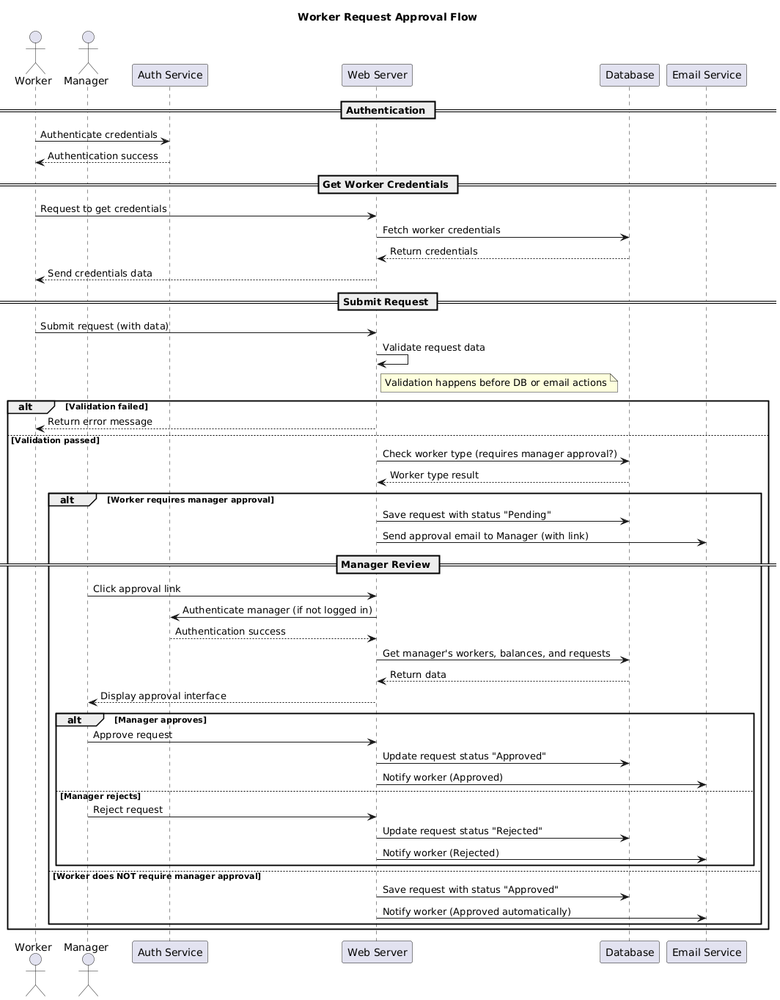
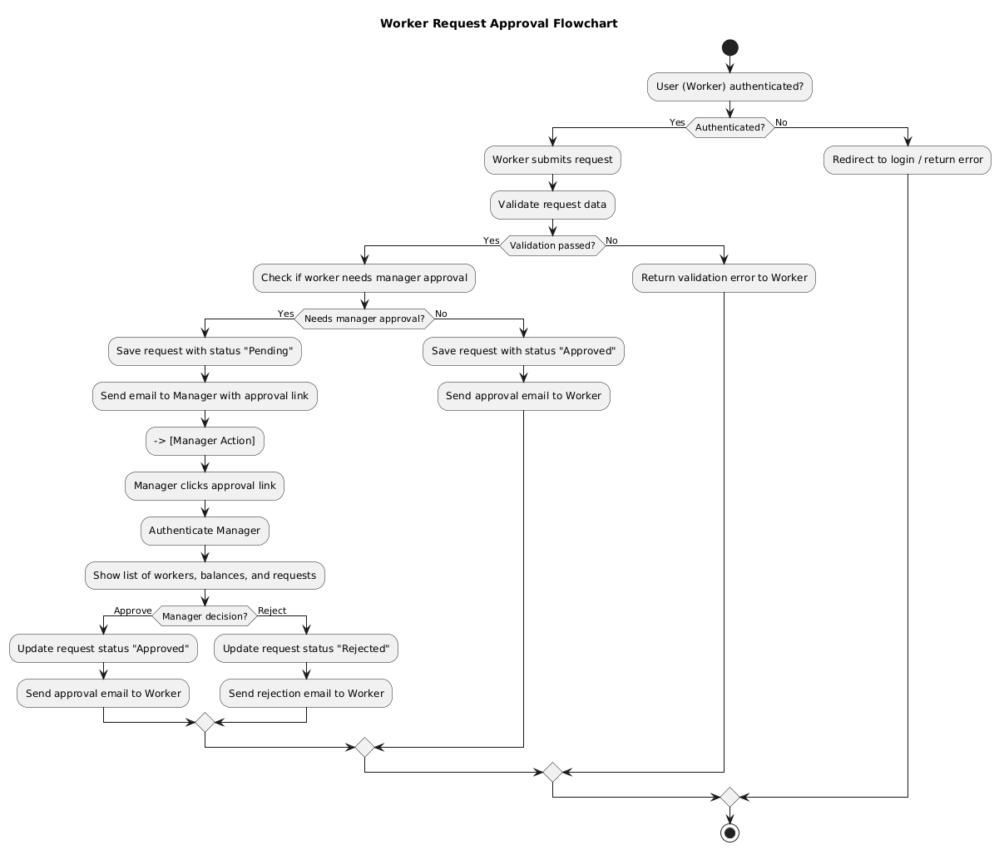

# 🌴 VACATION TRACKING SYSTEM (VTS) — Vision & Requirements

## 🧠 Vision
VTS aims to increase employee independence by improving internal business processes.  
It provides a solution to manage employment agreements and leave requests — reducing time and cost.

---

## 👥 Actors
- **Workers**
- **Managers**
- **Clerks**

---

## ⚙️ Functional Requirements
- Implements a flexible, rules-based system for validating and verifying leave-time requests.  
- Enables manager approval (optional).  
- Provides access to requests for the previous calendar year and allows requests up to 18 months in the future.  
- Uses email notifications to request manager approval and notify employees of request status changes.  
- Uses existing hardware and middleware.  
- Is implemented as an extension to the existing intranet portal system and uses the portal’s single sign-on mechanisms for authentication.  
- Keeps activity logs for all transactions.  
- Enables HR and system administration personnel to override restricted actions (with logging).  
- Allows managers to directly award personal leave time (within system-set limits).  
- Provides a web service interface for querying employee vacation summaries.  
- Interfaces with HR legacy systems to retrieve employee information and updates.

---

## 🧭 Non-Functional Requirements
- The system must be **easy to use**.

---

## 🎯 Use Case — Manage Time

**Use case name:** Manage Time  
**Actor:** Employee  
**Goal:** Submit a new vacation time request.  
**Preconditions:** The employee is authenticated via the portal and has privileges to manage vacation time.

### 🪜 Main Flow
1. The employee opens the VTS link from the intranet portal.  
2. VTS retrieves the employee’s current vacation requests and balances (past 6 months and up to 18 months ahead).  
3. The employee selects a vacation category with a positive balance.  
4. VTS prompts for vacation dates and hours (with a visual calendar).  
5. The employee enters the desired dates, hours, title, and description, then submits.  
6. If data is incomplete or invalid, the form is redisplayed with errors highlighted.  
7. The employee can modify or cancel the request.  
8. If valid, VTS confirms submission and, if required, sends an approval email to the manager.  
9. The request status becomes **Pending Approval**.  
10. The manager accesses the approval link or logs into the VTS.  
11. The manager authenticates (if required).  
12. VTS shows the manager’s own requests and those pending from subordinates.  
13. The manager reviews each request and approves or rejects it (with reason if rejected).  
14. The system notifies the employee by email and updates the request status.

---

## 🧩 Sequence Diagram


---

## 🔁 Flow Chart


---

## 💻 Pseudocode

```plaintext
FUNCTION processWorkerRequest(workerId, requestData):

    IF NOT AuthService.isAuthenticated(workerId):
        RETURN "Error: User not authenticated"
    ENDIF

    validationResult = Validator.validateRequest(requestData)
    IF validationResult == INVALID:
        RETURN "Error: Invalid request data"
    ENDIF

    workerType = Database.getWorkerType(workerId)

    IF workerType.requiresManagerApproval == TRUE THEN
        requestId = Database.saveRequest(workerId, requestData, status="PENDING")

        managerId = Database.getWorkerManager(workerId)
        approvalLink = WebServer.generateApprovalLink(requestId, managerId)
        EmailService.send(to=managerId,
                          subject="Approval Required",
                          body=approvalLink)

        RETURN "Request submitted and pending manager approval"
    ELSE
        requestId = Database.saveRequest(workerId, requestData, status="APPROVED")
        EmailService.send(to=workerId,
                          subject="Request Approved",
                          body="Your request has been auto-approved.")
        RETURN "Request approved automatically"
    ENDIF
END FUNCTION


FUNCTION handleManagerApproval(managerId, requestId, decision):

    IF NOT AuthService.isAuthenticated(managerId):
        RETURN "Error: Manager not authenticated"
    ENDIF

    request = Database.getRequestById(requestId)

    IF decision == "APPROVE":
        Database.updateRequestStatus(requestId, "APPROVED")
        EmailService.send(to=request.workerId,
                          subject="Request Approved",
                          body="Your manager has approved your request.")
    ELSE IF decision == "REJECT":
        Database.updateRequestStatus(requestId, "REJECTED")
        EmailService.send(to=request.workerId,
                          subject="Request Rejected",
                          body="Your manager has rejected your request.")
    ELSE
        RETURN "Error: Invalid decision value"
    ENDIF

    RETURN "Manager decision processed successfully"
END FUNCTION


MODULE AuthService:
    FUNCTION isAuthenticated(userId):
        // Verify session or token validity
        RETURN TRUE or FALSE
    END FUNCTION
END MODULE


MODULE Validator:
    FUNCTION validateRequest(data):
        // Apply business rules for validation
        RETURN VALID or INVALID
    END FUNCTION
END MODULE


MODULE Database:
    FUNCTION getWorkerType(workerId)
    FUNCTION getWorkerManager(workerId)
    FUNCTION saveRequest(workerId, data, status)
    FUNCTION updateRequestStatus(requestId, status)
    FUNCTION getRequestById(requestId)
END MODULE


MODULE EmailService:
    FUNCTION send(to, subject, body):
        // Queue email for delivery
    END FUNCTION
END MODULE


MODULE WebServer:
    FUNCTION generateApprovalLink(requestId, managerId):
        RETURN "https://intranet.company.com/approve?req=" + requestId + "&mgr=" + managerId
    END FUNCTION
END MODULE
